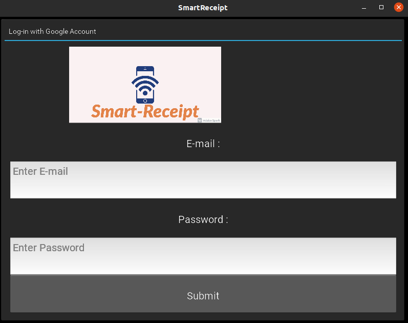
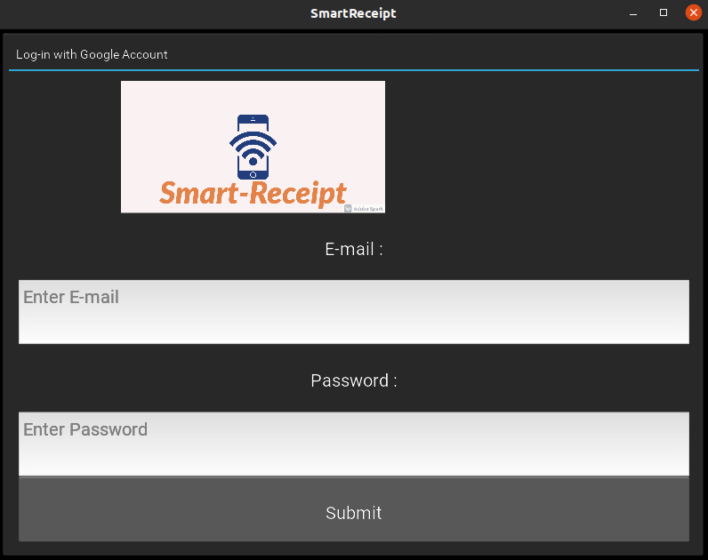
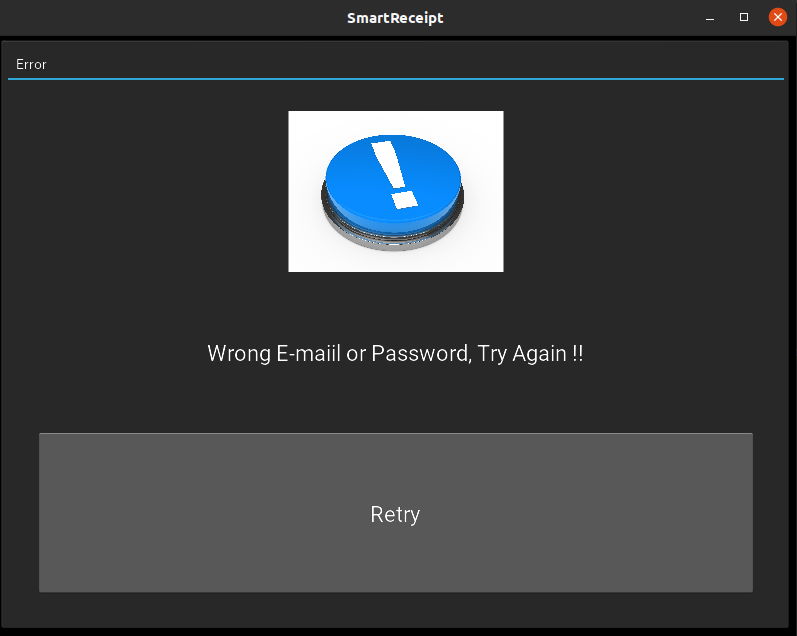
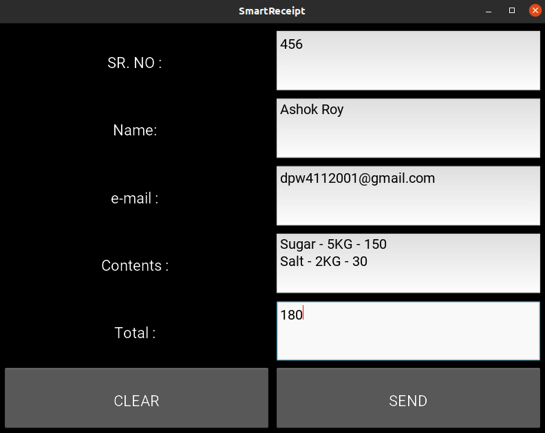
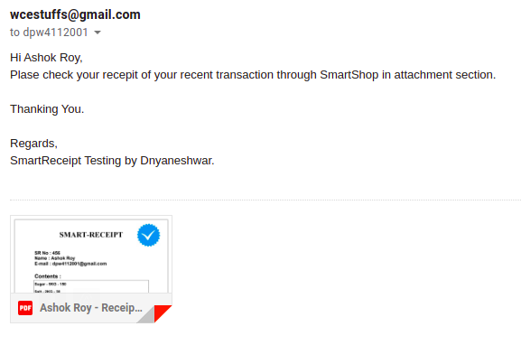

## Lets get started
  + First there will  be login with Google account window.Fill the correct credentials and click on SUBMIT
   
   
   
   
   
  + if the credentials are wrong the error window will appear.click on retry to give correct credentials.
  
  
  
  
 + now after in new window fill all the details and click on SUBMIT.If you want to clear all fields click on CLEAR
 
 
 
 + Make sure that PC is connected to internet.After successfully sending message the sent window will appear.
 

 + Check Your sent folder in G-Mail to confirm.
 
