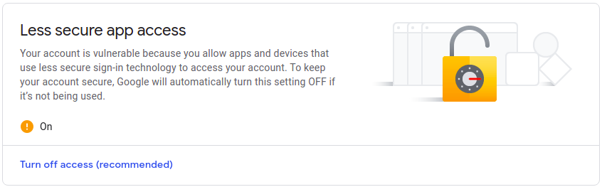

# Smart-Receipt-Generator
A python based GUI App to send billing receipt to the customer through e-mail using python.

## Youtube Link: <a href="https://www.youtube.com/watch?v=vkfLOmbklks">https://www.youtube.com/watch?v=vkfLOmbklks</a>

## Lets Learn more about it...

## Python tools used:
  + Kivy GUI library (Learn more about kivy : <a href = "https://kivy.org/">https://kivy.org/</a>)
  + smtplib in Python (Simple Mail Transfer Protocol)
      + get more information about smtplib : <a href="https://docs.python.org/3/library/smtplib.html">https://docs.python.org/3/library/smtplib.html</a>
  + FPDF library in Python(for creating pdfs) 
      + checkout it at : <a href="https://pypi.org/project/fpdf/">https://pypi.org/project/fpdf/</a>

## Important Instructions before using
  + If we want to use mail service of google account we need to allow less secure app access for using SMTP service.
    + You can follow this link to allow less secure app access:<a href="https://myaccount.google.com/lesssecureapps">https://myaccount.google.com/lesssecureapps</a>
    + Allowing this access doesn't mean that Google account will be totally unsecure.
  

## Always open for any further suggestions...
